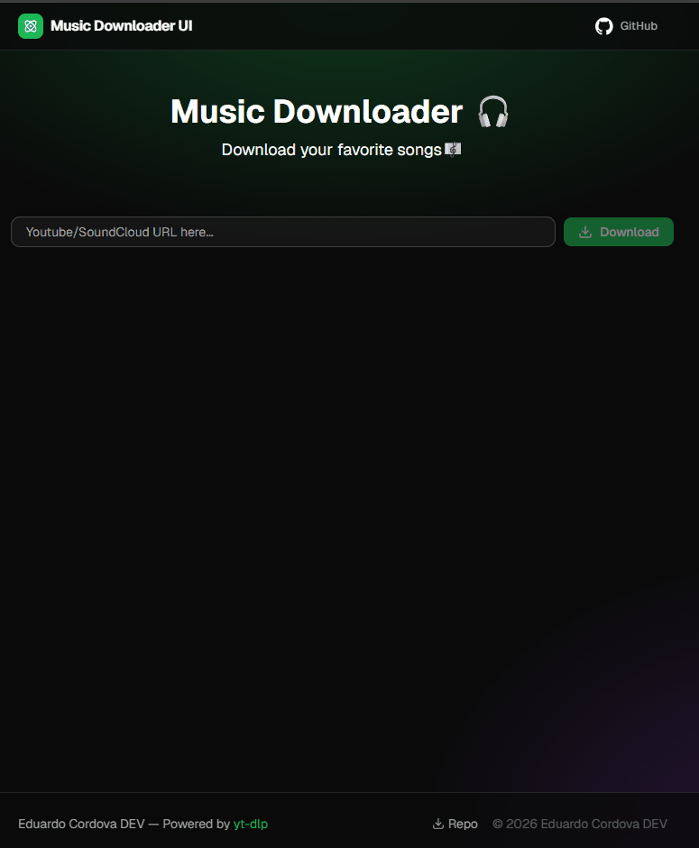

---

# 🎵 Music Downloader — Fullstack App

> A modern, responsive UI + backend powered by [yt-dlp](https://github.com/yt-dlp/yt-dlp).  
> **Note:** This project runs strictly in a **local environment** and requires **YT-DLP** installed on your system.

---



---

## ✨ Features

- 🔗 Paste any YouTube or SoundCloud URL to download high-quality tracks
- 📊 Real-time download progress bar with success state
- ✅ URL validation with inline error feedback
- 🌙 Dark mode inspired by Spotify
- 📱 Fully responsive layout
- ⚡ Backend with REST API + Socket.io for real-time feedback
- 🛠️ Powered by **YT-DLP** (local installation required)

---

## 🖥️ Tech Stack

| Tool            | Purpose                      |
| --------------- | ---------------------------- |
| React 18        | UI Framework                 |
| TypeScript      | Type safety                  |
| Vite            | Build tool & dev server      |
| Tailwind CSS v4 | Styling                      |
| shadcn/ui       | Component library            |
| Sonner          | Toast notifications          |
| Lucide React    | Icons                        |
| Node.js         | Backend runtime              |
| Express         | API server                   |
| Socket.io       | Real-time communication      |
| dotenv          | Environment variables        |
| yt-dlp          | Core download engine (local) |

---

## 🚀 Getting Started

### Prerequisites

- Node.js `>=18`
- npm or pnpm
- **YT-DLP installed locally** (mandatory requirement)

### Installation

```bash
# Clone the repository
git clone https://github.com/EduardoCordova-DEV/music-downloader.git

# Navigate into the project
cd music-downloader

# Install dependencies for frontend and backend
cd frontend && npm install
cd ../backend && npm install

# Return to the root and start both services
cd ..
npm start
```

- **Frontend:** available at `http://localhost:5173`
- **Backend:** available at `http://localhost:3001`

---

## 📁 Project Structure

```
music-downloader/
├── frontend/        # React + Vite + Tailwind
│   ├── src/
│   ├── public/
│   └── package.json
│
├── backend/         # Node.js + Express + Socket.io
│   ├── src/
│   ├── server.js
│   └── package.json
│
├── package.json     # Root scripts (concurrently)
├── README.md
└── .gitignore
```

---

## 📦 Scripts

```bash
npm start        # Run frontend + backend concurrently
npm run dev      # (inside frontend/) start Vite dev server
npm run build    # Build frontend for production
npm run preview  # Preview production build
```

---

## 🔌 Backend API Example

```ts
// POST /api/download
const handleDownload = async (url: string) => {
  const response = await fetch('http://localhost:3001/api/download', {
    method: 'POST',
    headers: { 'Content-Type': 'application/json' },
    body: JSON.stringify({ url }),
  })
  const data = await response.json()
  console.log(data)
}
```

---

## 📄 License

MIT © EduardoCordova-DEV

---

<p align="center">Made with ❤️ for music lovers — powered by YT-DLP</p>

---
